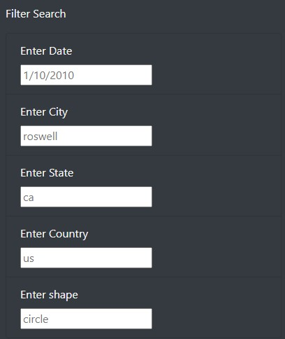
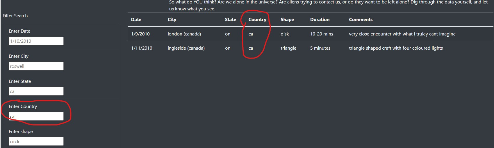

# UFOs

## Purpose:
The purpose of this project was to develop a website for a friend, Dana, who has a collection of alien sighting evidence that she would like to display and make filterable in an effort to convice more people that aliens are among us.

## Results:
Filtering the data on the created website is quite intuitive.  There are 5 different text entry fields, date, city, state, country, and shape of UFO.  To filter the data one simply needs to click onto the text field corresponding to the parameter they wish to alter and then simply type in their desired filter criteria.  Take a look at the pictures below to note how someone could filter for UFO sightings in Canada.

### Data Filters Picture:

### Filtered Data Picture:

## Summary:
One of the major drawbacks I see in the created website is that it seems quite bland.  I do like the title with the nasa image in the background, but other than that everything is literally black and white.  I would offer 2 suggestions to spruce up the site:
- Consider changing the filters so that instead of users typing they can simply select what they want to filter for from a list.  IE a list of countries or states that autopopulates based upon the data.
- I really believe that the color scheme could be updated to something that is more exciting than black and white.  Perhaps some alien green...?
